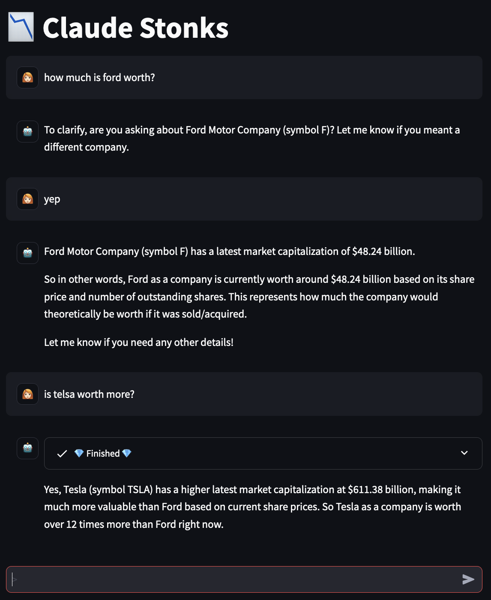

# Claude Stonks Agent

An example [langchain](https://www.langchain.com/)+[langgraph](https://python.langchain.com/docs/langgraph) agent using [Anthropic's Claude 2.1](https://www.anthropic.com/news/claude-2-1) on [AWS Bedrock](https://aws.amazon.com/bedrock/) to demonstrate function calling. 

Creates answers using [langchain tools](https://python.langchain.com/docs/modules/agents/tools/) that expose the [alphavantage.co stock market API](https://www.alphavantage.co/documentation/).

Also has a very basic [Streamlit UI](https://docs.streamlit.io/library/api-reference/chat).




# Setup

## Install

This is just using a python virtual environment.

```sh
python3 -m venv .venv
source .venv/bin/activate
pip install -r requirements.txt
```

## Environment Variables

You'll need an AWS account with Claude 2.1 enabled on Bedrock.
Setup a user to access this and set the correct environment variables for boto3 sessions to use it by default.
For example create a profile in `~/.aws/config` and set the `AWS_PROFILE` environment variable.

You'll also need a alphavantage.co API key which is available here: [get free API key](https://www.alphavantage.co/support/#api-key).
The free key is limited to 25 requests a day, so to do more experiementation you'll need a premium key: [buy premium key](https://www.alphavantage.co/premium/).

We use a `.env` file and [`python-dotenv`](https://pypi.org/project/python-dotenv/) to load it.
Create a `.env` file with something like:

```
AWS_PROFILE=your-profile-name
ALPHA_VANTAGE_API_KEY=your-key
```

## Running the UI

You should just be able to run the Streamlit UI with:

```sh
streamlit run ui.py
```

# Notable points

 - Claude 2.1 tool/function calling is mentioned as being in "early access" so almost certainly will change. ([docs](https://docs.anthropic.com/claude/docs/claude-2p1-guide))
 - The prompts for tool usage used here are based on [`anthropic-tools`](https://github.com/anthropics/anthropic-tools) that also makes clear: _This SDK is Currently in Alpha. We promise no ongoing support. It is not intended for production use._
 - I found the Bedrock client from langchain needed a little customization to work well. See the `ClaudeBedrock` implementation in `claude.py`. Do let me know if there are better ways of doing this.
   - The `fix_prompt` function to change the `AI:` to `Assistant:` prefixes.
   - Setting the `</function_calls>` stop token in the model kwargs rather than then usual langchain way of binding it as a stop token on the model.
 - Isn't this stonks thing a bit silly? Yep.

# Missing Bits

 - Based on the `anthropic-tools` example it looks like multiple function calls are possible in a single response, but this is not yet explored.
 - There is no tool error handling. Again, there is some examples of this in `anthropic-tools`.